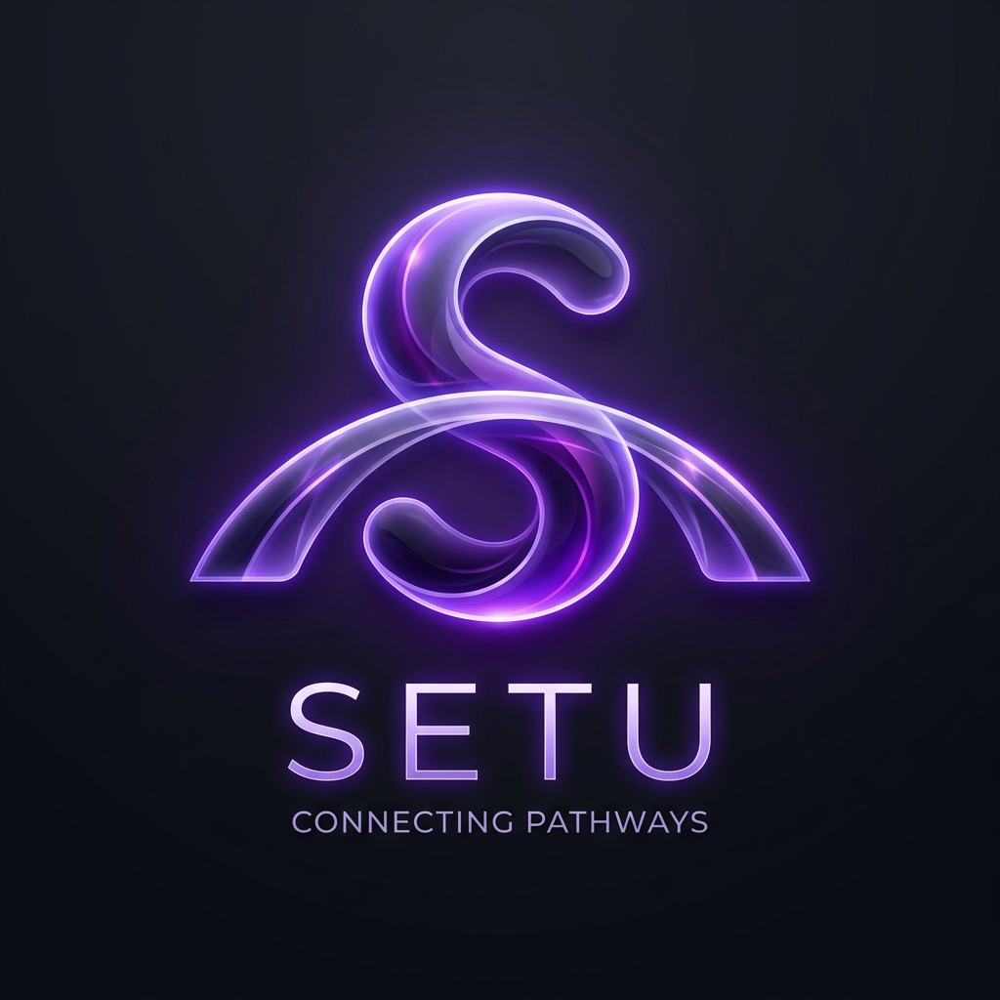

<div align="center">
  
  <h1>Project Setu (SEAT-SET)</h1>
  <p><strong>A high-performance, mobile-first, intelligent decision-support system guiding 500,000+ EAPCET students through the counseling chaos, completely free of cost.</strong></p>

  <p>
    
    
    
    
    
  </p>
</div>

---

## 🌟 The Vision

Project Setu (SEAT-SET) is built with a singular mission: democratize access to high-quality educational counseling for rural and urban students alike. Through a combination of **deterministic data engineering**, **advanced Retrieval-Augmented Generation (RAG)**, and **multi-model routing**, Setu provides highly accurate, hallucination-free guidance for TS EAPCET (MPC & BiPC) admissions.

---

## 🏗️ The 3-Tier Intelligence Architecture

Setu avoids the pitfalls of standard "wrapper AI" apps. It routes requests intelligently based on the need for speed, accuracy, or reasoning:

### 1. Tier 1: Deterministic Engine (Speed & Accuracy)
- **Probabilistic Rank Predictor:** Instantly categorizes college branches into *Safe*, *Probable*, and *Dream* via deterministic SQL queries on historical cutoffs. **Zero LLM involvement, zero hallucination.**
- **Management Quota Transparency:** Access official AFRC-sanctioned fees.
- **Phase-Gap Seat Matrix:** Tracks vacancies dynamically across counseling rounds.

### 2. Tier 2: Knowledge RAG (Expert Guidance)
- **Rulebook AI:** Solves complex queries regarding eligibility, fee reimbursement, and local status. 
  - *Pipeline:* Local Embedding (`all-MiniLM-L6-v2`) → pgvector search (Supabase) → Cohere neural reranking → Gemini 2.5 Flash generation (with native Telugu/English toggling).
- **Branch Matchmaker:** A profiling quiz providing AI-generated insights on branch alignment with student interests.

### 3. Tier 3: Stateful Agents (Journey Management)
- **Option Strategy Guard:** Powered by Groq (Llama-3.3-70b-versatile) & PydanticAI. Autonomously reviews a student's proposed web options list and flags strategic mistakes (Priority Traps, premature freezing, etc.).

---

## 🛠️ The Tech Stack

### Frontend (Zero Egress, High Performance)
- **Framework:** Next.js 15 (App Router, React 19)
- **Hosting:** Cloudflare Pages (Optimized for rural accessibility and edge caching)
- **Styling:** Tailwind CSS + Lucide Icons
- **State/Querying:** TanStack Query + Axios

### Backend & AI (Multi-Model Orchestration)
- **Framework:** FastAPI (Python)
- **Agent Framework:** PydanticAI v1.90.0
- **Database:** Supabase (PostgreSQL) + pgvector 
- **Embeddings:** HuggingFace `all-MiniLM-L6-v2` (Running 100% locally for $0 cost)
- **LLM Routing:**
  - *Gemini 2.5 Flash:* Massive context reading and translation.
  - *Groq Llama-3:* Lightning-fast logical routing.
  - *Cohere:* Rerank API (v3.0) for vector search noise reduction.

---

## 🚀 Getting Started

### Prerequisites
- Node.js (v18+)
- Python (3.10+)
- Supabase Project with `pgvector` enabled

### 1. Setup Backend
```bash
cd backend
python -m venv venv
source venv/bin/activate  # Or `venv\Scripts\activate` on Windows
pip install -r requirements.txt

# Start the FastAPI Server
uvicorn main:app --reload --port 8000
```

### 2. Setup Frontend
```bash
cd frontend
npm install

# Start the Next.js Development Server
npm run dev
```

### 3. Environment Variables
You will need `.env` files populated in both `backend/` and `frontend/` matching the project configuration (Supabase URLs, Gemini API keys, Groq API keys).

---

## 📂 Project Structure

- `/frontend` - Next.js UI, Edge runtime configurations, React Query logic.
- `/backend` - FastAPI server, PydanticAI agents, JSON master branch data.
- `/docs` - Master architecture logs, development trackers, and historical context.
- `/_archive` - Legacy data engineering scripts, initial PDF rulebook raw data, and database ingestion files (`embed_rulebooks.py`, `upload_to_supabase.py`, etc.).

---

## 🔒 Constraints & Principles

1. **No-Hallucination Policy:** Numerical data comes from direct SQL queries. Models never "guess" rank cutoffs.
2. **Rural Accessibility:** Designed mobile-first, ensuring low bandwidth optimization and a seamless **Telugu/English toggle**.
3. **$0 Operational Cost Strategy:** Leveraging generous free tiers across Supabase, Gemini, Groq, and Cloudflare Pages.

---

> *"Bridging the gap between raw data and student dreams."*
